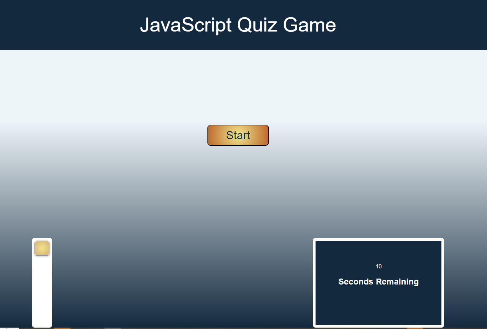
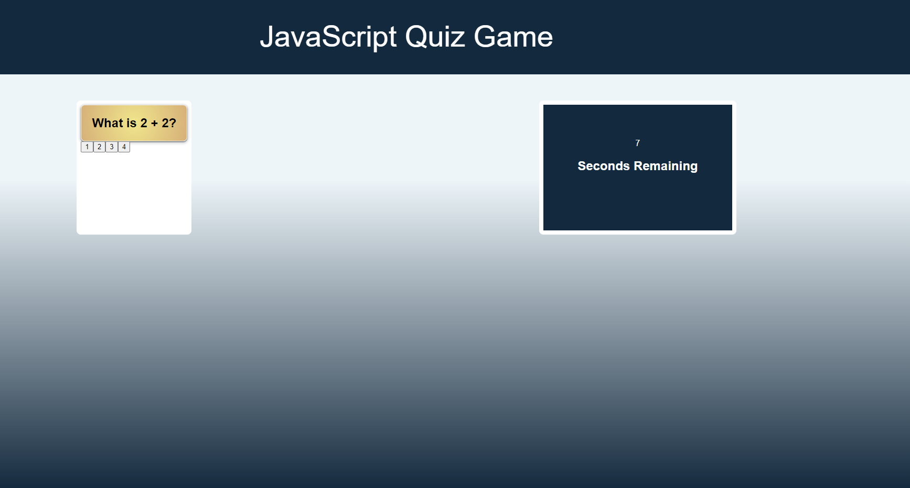

# JavaScript Quiz

## Objective
The purpose of this challenge is to create a Web API that consist of making a coding quiz game. The game will contain multiple choice questions and the user will have to answer
the question by clicking on what they think is the correct answer. If the answer is correct it will display a message saying "Correct", if not then it will display "Incorrect". Also, there is a timer set per question and if the timer runs out a message will display "Time's Up". 

Here is the start of the game:

Here is what the first question would look like:
