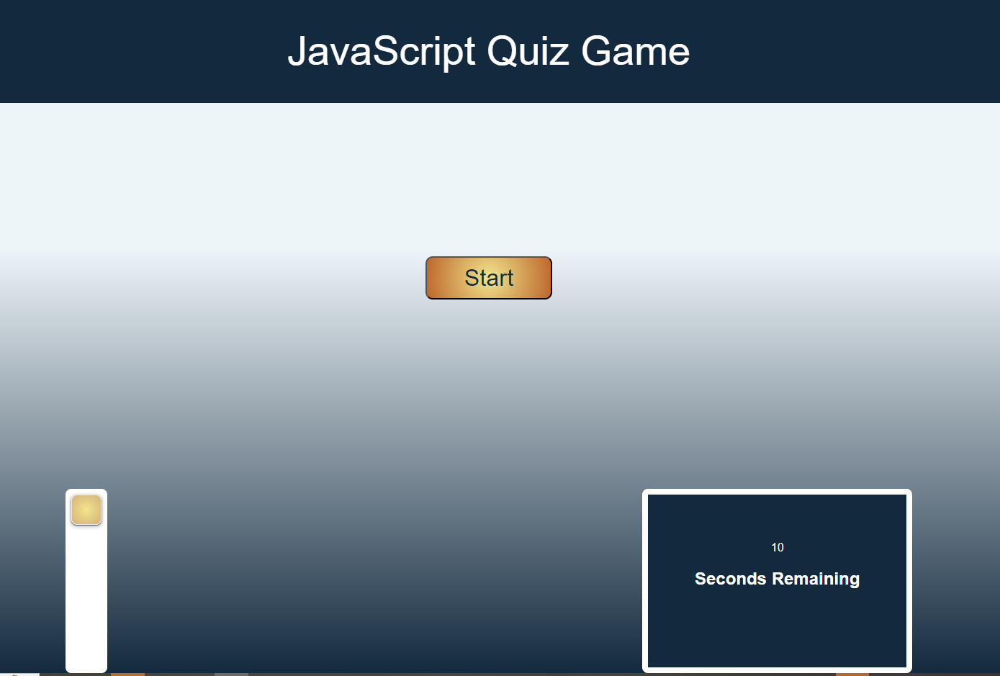
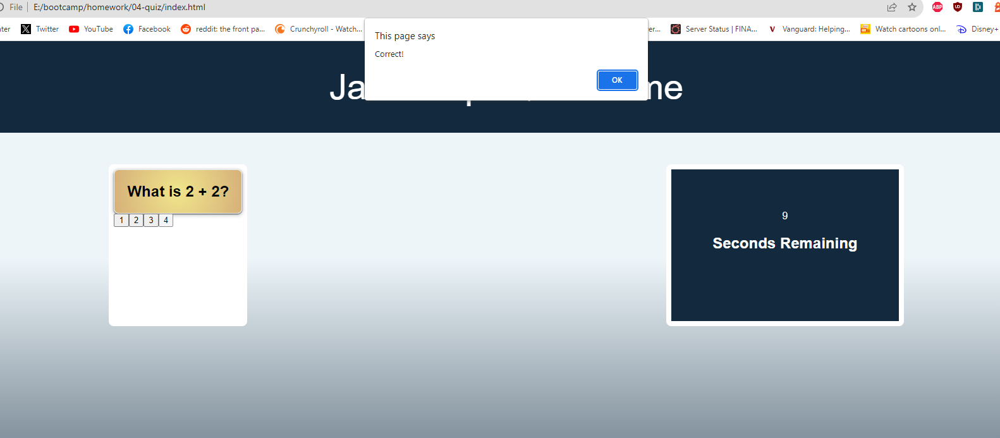
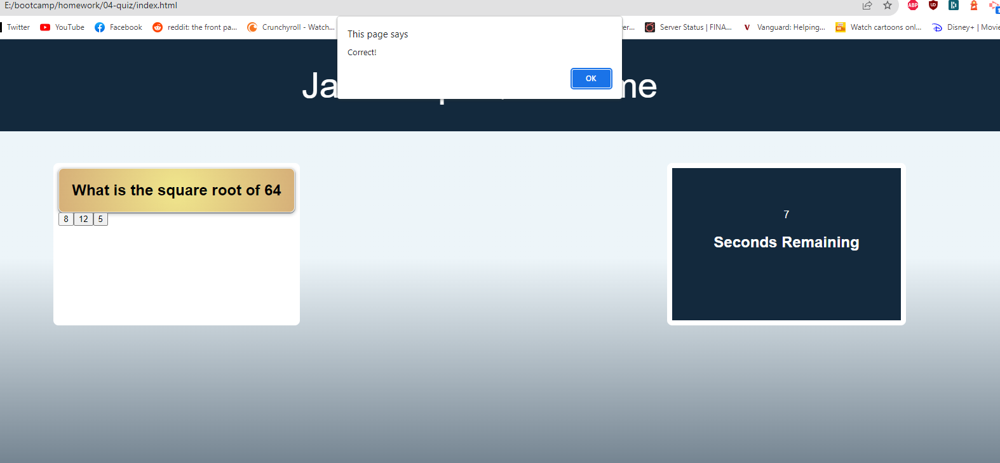
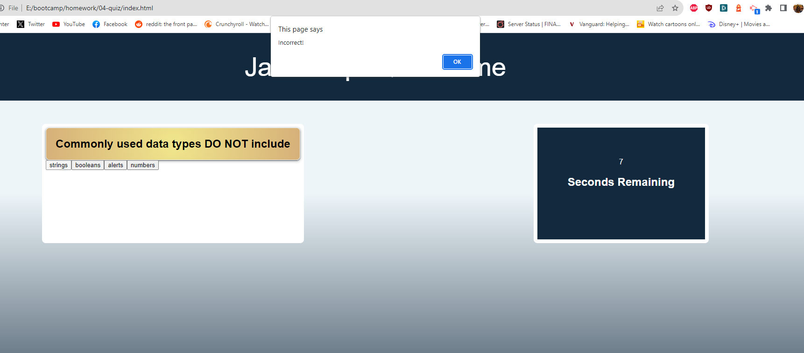
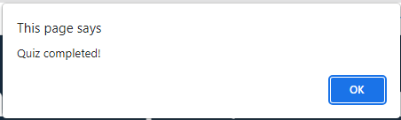

# JavaScript Quiz

## Description
The purpose of this challenge is to create a Web API that consist of making a coding quiz game. The game will contain multiple choice questions and the user will have to answer
the question by clicking on what they think is the correct answer. If the answer is correct it will display a message saying "Correct", if not then it will display "Incorrect". Also, there is a timer set per question and if the timer runs out a message will display "Time's Up". 

The quiz will contain a JavaScript file, a CSS file, and a HTML file. The JavaScript script will contain the questions and have functions that will display the question, display the result, and even start the timer for each question.

## Technology Used
- JavaScript
- CSS
- HTML

## Testing

Here is the start of the game:

When the user clicks on the correct answer, it will display an alert whether the answer is correct or not:

Then after the user gets the current question right, it will go to the next question:

If the user gets a question wrong, then the alert will say "incorrect":

Once all questions have been answered correctly, an alert will say "Quiz Completed":

## Updates
- Updated more on the github repo
- Once user gets current question correct, it will move to the next question
- Added more screenshots
